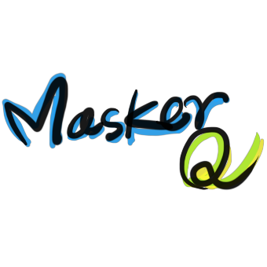

# game-masker-q

Masker Queue, Arcade genre, is a game picks people in the queue one by one and passes only those who wear mask. 
This game is created using **Ruby** and **Gosu** (2D Game Development Library).

## Execute Game

After installing **Ruby**, You can install **Gosu** by entering the command below. My working environments are *Ruby 2.7.2p137 [x64-mingw32]* and *gosu-0.15.2-x64-mingw32*.

`gem install gosu`

Now then, you can execute *main.rb* and play the game! Please enjoy it. 😋

`main.rb`

Or you can build *exe* file with *Ocra* like:

`ocra main.rb scripts/** images/*.png sounds/*.wav --chdir-first --windows --dll ruby_builtin_dlls\libssp-0.dll --output maskerq.exe`

## How To Play
All you have to do is pressing *4-direction* keys and *Space-bar* key. By default, You have to move people to the left by pressing *Left* key, and move to the right them by *Right* key. For a particular person, you may have to press others, *Up/Down* and *Space-bar* key.

## Sound Resource Credits
    filename: sounds/duskwalkin.wav
    author: supervanz
  link: https://freesound.org/people/supervanz/sounds/428858

    filename: sounds/footstep.wav
    author: RutgerMuller
  link: https://freesound.org/people/RutgerMuller/sounds/50725/

    filename: sounds/success.wav
    author: MattLeschuck
  link: https://freesound.org/people/MattLeschuck/sounds/511484/

    filename: sounds/warning.wav
    author: Serithi
  link: https://freesound.org/people/Serithi/sounds/150326/

    filename: sounds/gameover.wav
    author: SoundEffectsPodcast_com
  link: https://freesound.org/people/SoundEffectsPodcast_com/sounds/256091/

## Graphic Resources
[@jubin-park](https://github.com/jubin-park) all has graphic credits.